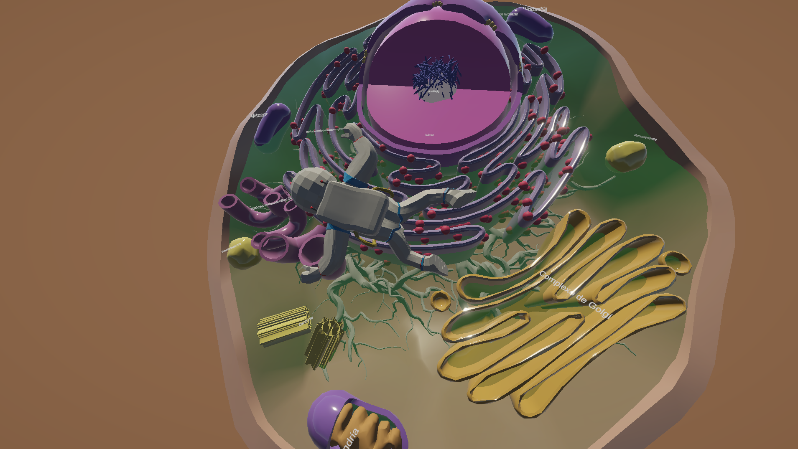
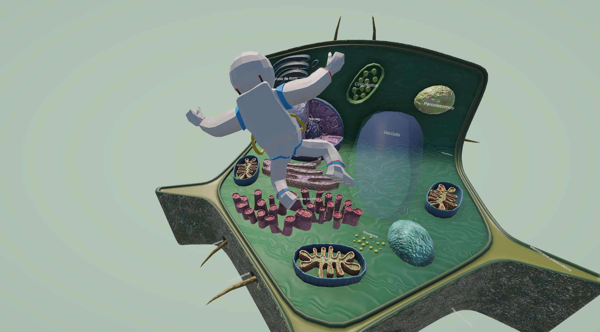
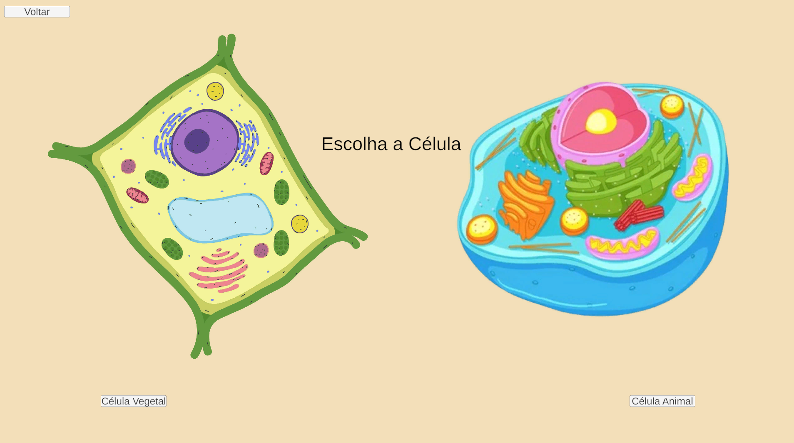

# Aventura na Célula

**Aventura na Célula** is a 3D educational game designed to support the teaching and learning of cell biology through interactive exploration.

The game allows students to enter and explore the interior of **animal and plant cells**, discovering cellular structures and learning about the functions of different organelles in an interactive three-dimensional environment.

## 🎮 About the Game

Instead of studying the cell only through static images and diagrams, players can explore a virtual cellular environment by walking through its internal structures.

The game was developed with an educational and science communication purpose, aiming to make cell biology more accessible, visual, and engaging for high school students.

## 🔬 Educational Features

* Interactive 3D exploration
* Animal cell environment
* Plant cell environment
* Exploration of cellular organelles
* Information about organelle functions
* First-person exploration
* Educational content focused on cell biology

## 🧫 Animal Cell

The animal cell environment allows students to explore cellular structures and visualize the organization of the cell in three dimensions.

## 🌱 Plant Cell

The plant cell environment introduces students to the particular characteristics of plant cells and allows them to explore structures such as the cell wall, chloroplasts, and large central vacuole.

## 🎯 Target Audience

The game was primarily developed for:

* High school students
* Biology teachers
* Science communication activities
* Educational institutions
* Students interested in cell biology

## 💻 System Requirements

**Platform:** Windows

The game is distributed as a standalone Windows application.

> All files included in the downloaded package should remain in the same folder for the game to work correctly.

## 📥 Download

The latest version of the game can be downloaded from the **Releases** section of this repository.

### Latest release

**Aventura na Célula v1.0 – First Release**

[Download the latest version](../../releases/latest)

## 📸 Screenshots

### Animal Cell

### Plant Cell

### Choose your Cells

## 🎓 Educational Purpose

Aventura na Célula was developed as an educational and science communication resource to support the teaching of cell biology through interactive and immersive digital experiences.

The project seeks to provide students with an alternative way of understanding cellular organization by allowing them to explore structures that are usually represented through two-dimensional illustrations.

## 👨‍🔬 Author

**Juan Carlos Ramos de Oliveira**

MSc Student in General and Applied Biology
Institute of Biosciences – São Paulo State University (IBB/UNESP)

## 📚 Project

This project is part of an initiative focused on science communication and the development of educational resources for biology education.

## 📄 License

Aventura na Célula is available for educational and non-commercial use under the **Aventura na Célula Educational Non-Commercial License**.

The game may be freely used in schools, universities, classrooms, educational activities, workshops, and science communication initiatives.

Commercial use, sale, licensing, or modification of the game is not permitted without prior written authorization from the copyright holder.

See the [LICENSE](LICENSE) file for the complete terms.

## 🤝 Contributions

Suggestions, feedback, bug reports, and educational suggestions are welcome.

If you find a problem with the game, please open an **Issue** in this repository.

## 🎮 Download

---

**Aventura na Célula**
*Exploring the cell through an interactive 3D experience.*

